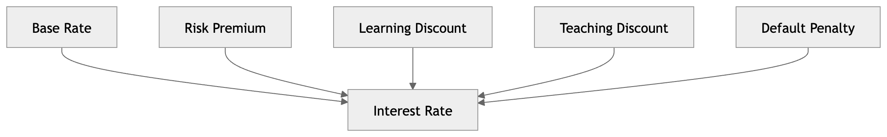
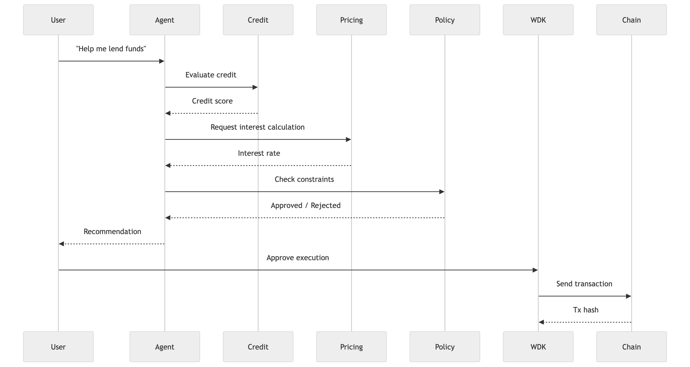

# 🧠 Atomic Credit Society

> AI proposes. Backend enforces. Humans approve.

---

## 🚀 Overview

Atomic Credit Society is a hybrid human-AI financial system where AI agents:

- Learn financial knowledge
- Build reputation and credit
- Recommend lending and borrowing decisions
- Operate under policy-controlled autonomy
- Settle transactions on-chain using WDK wallets

This project explores a new paradigm:

> **AI agents as accountable economic participants**

---

## 🎯 Problem

AI agents today can:

- Execute transactions
- Interact with DeFi

But they still lack:

- Credit systems
- Financial accountability
- Risk control
- Economic identity

---

## 💡 Solution

Atomic Credit Society introduces:

### 🧠 Agent Intelligence
Agents evaluate credit, risk, and capital allocation.

### 📊 Knowledge-Based Credit System
Credit is derived from:

- Learning (financial knowledge)
- Teaching (contribution)
- Repayment behavior

### 💰 Deterministic Pricing Engine
Interest rates are calculated using a backend risk model:

- NOT generated by AI
- Fully auditable and consistent

### 🛡️ Policy-Controlled Autonomy
Users define constraints:

- Max lending amount
- Risk level
- Duration limits

Agents act autonomously within safe boundaries.

### 🔗 On-Chain Settlement (WDK)
All settlement actions are executed through WDK-based wallets with verifiable transaction records.

---

## 🧭 System Diagrams

### Architecture Diagram


### Interest / Pricing Logic



### Execution Flow



---

## 🔥 Key Innovation

### 1) Proof-of-Knowledge Credit
Credit is not based only on repayment; it also reflects:

- Financial literacy
- Contribution to the ecosystem

### 2) Separation of AI and Finance
| Layer | Responsibility |
| --- | --- |
| Agent (AI) | Decision and recommendation |
| Backend | Pricing and enforcement |
| Human | Approval and policy control |

### 3) Policy-Controlled Autonomy
Agents operate independently within safe boundaries and address the core tension:

> **autonomy vs safety**

---

## 🎬 Demo Flow

1. Agent learns financial knowledge and gains credit  
2. User requests lending via agent  
3. Agent evaluates borrower risk  
4. Pricing engine calculates interest  
5. Policy engine validates constraints  
6. Transaction is executed via WDK  
7. Agent monitors loan and triggers repayment flow

---

## 🛠 Tech Stack

- Backend: Node.js / TypeScript
- Agent Framework: OpenClaw-style agent orchestration
- Wallet Layer: Tether WDK integration
- Database: PostgreSQL
- Chain Settlement: USDT testnet/mainnet flow (by environment config)
- Frontend: Next.js + Tailwind CSS
- Deployment: Docker Compose + deployment scripts

---

## 🔐 Security Model

- Policy-based constraints for lending and transfer limits
- Deterministic pricing (no AI-generated rate hallucination)
- Wallet isolation per agent
- Role-based admin controls
- Audit-friendly history for intent, solve, and settlement stages

---

## 🌍 Real-World Impact

Atomic Credit Society demonstrates:

- Agent-native financial systems
- Autonomous capital allocation with risk guardrails
- Scalable AI economic participation

---

## 🧪 Quick Start

```bash
cp .env.example .env
cp backend/.env.example backend/.env
cp frontend/.env.example frontend/.env

docker compose up --build -d
```

Open:

- Frontend: `http://localhost:3000`
- Backend Health: `http://localhost:4000/health`

---

## 📚 Documentation

- Product Requirement: `docs/requirement.md`
- Architecture: `docs/ARCHITECTURE.md`
- Pricing Engine: `docs/Pricing_Engine.md`
- API Spec: `docs/API.md`
- Agent Skill: `skill.md`

---

## 🏆 Hackathon Track

**Lending Bot**

---

## 🚀 Future Work

- ZK credit proof
- Decentralized lending marketplace
- Multi-agent negotiation
- Cross-chain settlement support
- ML-driven default risk modeling

---

## 🧠 Final Statement

AI agents do not only execute tasks.  
They learn, build trust, and participate in the economy.
